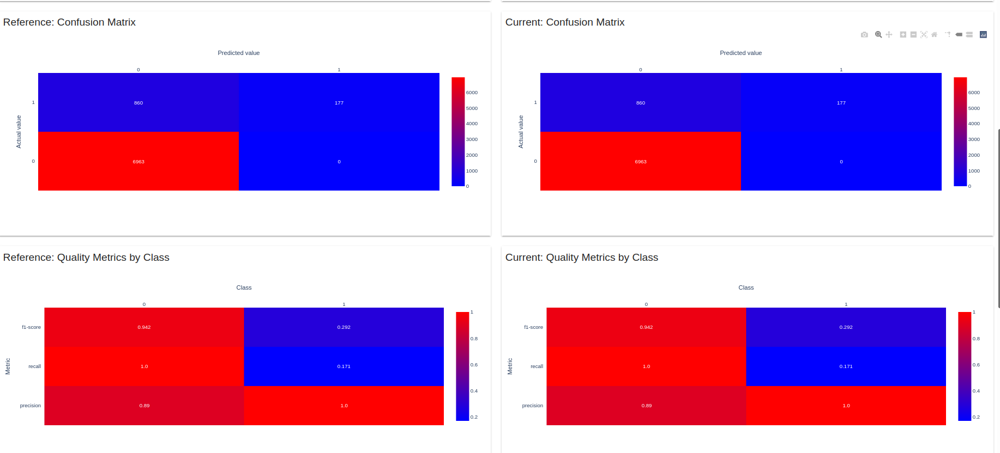
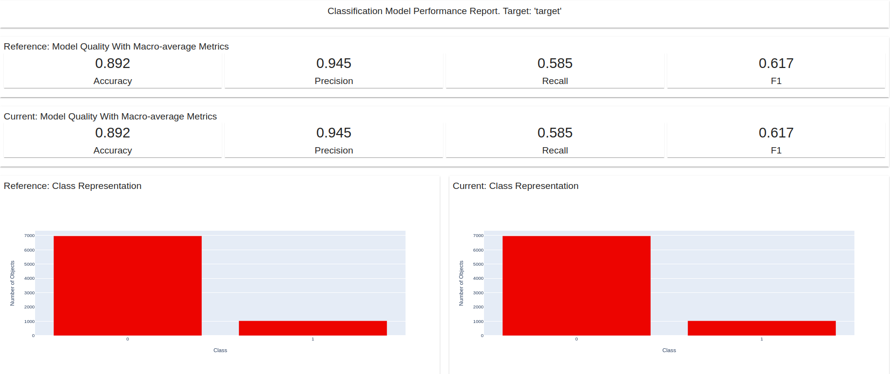
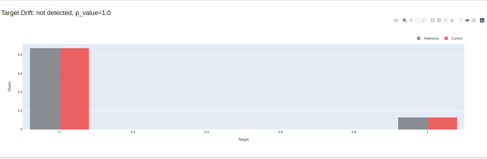
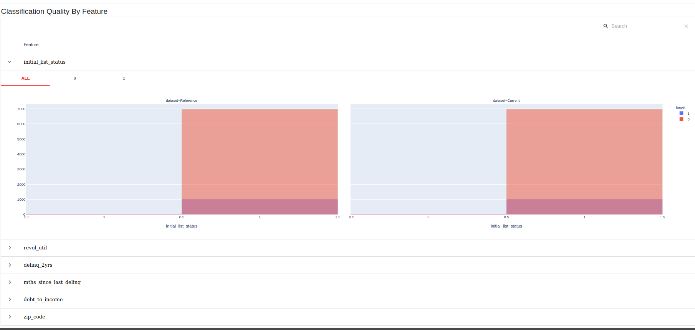
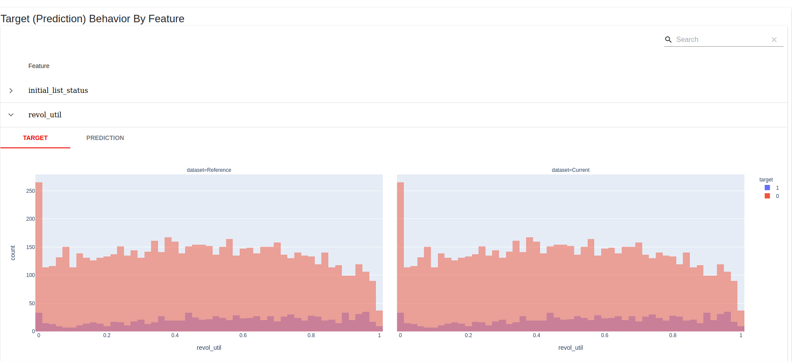
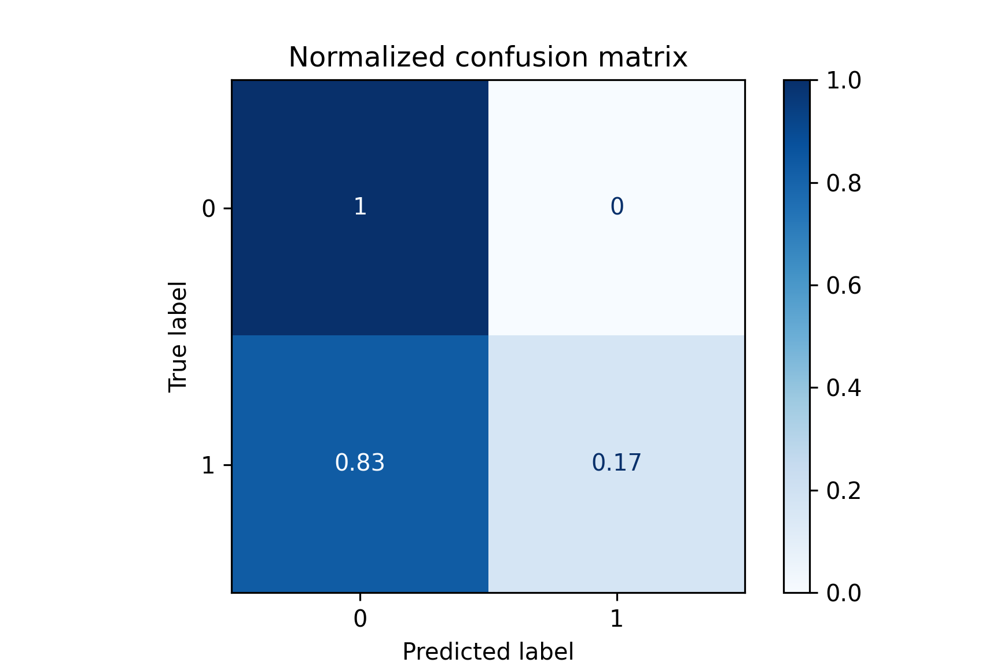
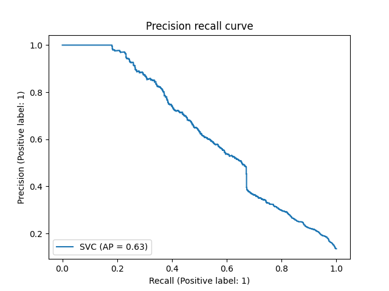
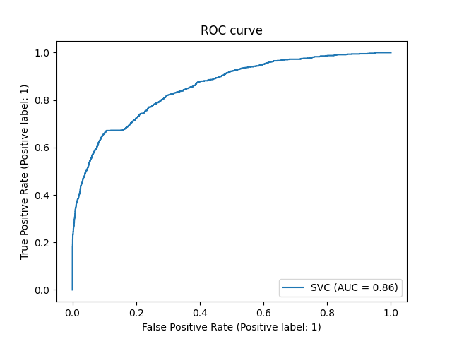

[](https://github.com/OuedraogoAbdoul/deploy_ML_DVC_MLFLOW_CICD/actions/workflows/main.yml)

# Machine learning End-End

This project highlight an end to end machine learning development including data, target and model drift monitoring. 

## Installation

Use the package manager [pip](https://pip.pypa.io/en/stable/) to install make.

```bash
pip install make
```

## Usage

```python
make build: to build the docker environment

make preprocess: 'to download data and preprocess it'

make train_model: 'to train the model'

make predict: 'to make prediction'

'Alternative using dvc'

dvc repro: 'To train and predict'

```

## Contributing
Pull requests are welcome. For major changes, please open an issue first to discuss what you would like to change.

Please make sure to update tests as appropriate.

## Reports

### Data drift



### Target drift


''


'Target drift by features'



### Drift by features


## Metrics

### Confusion



### Precision and Recall



### ROC AUC



## License
[MIT](https://choosealicense.com/licenses/mit/)
